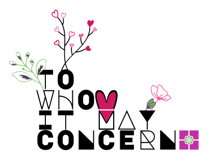

<!-- "Hallo Welt" an die SEHR SEHR SEHR außerordentlich geschätzten Leser:innen der Kommentare! Ihr technisch versierten Genies ❤️ -->
Unterm Strich – Schlussstrich hin oder her – bin ich immer noch wahnsinnig froh, dass es dich gibt. Punkt. 
<!-- [Das ist die Kurzfassung, aus bekannten Gründen].  -->
Die Welt als Ganzes wäre wahrscheinlich kein viel schlechterer Ort ohne dich. Das ist wahr. Aber für mich und ein paar andere wenige Menschen ist die Welt ein kleines bisschen besser geworden. Das kann ich immer noch von Herzen (beim Verstand bin ich mir da nicht mehr so sicher – aber doch noch ziemlich sicher;) behaupten. In diesem Sinne. Du weißt ja schon… 😉
Und auf ein Neues: schön, dass es dich gibt! 🎁
<!-- 💘 Das ist nicht weniger von Herzen als bisher. Eher noch mehr. Und wahrscheinlich noch glaubhafter? 💘 -->
<!-- Und ALLES ALLES GUTE dir! -->
