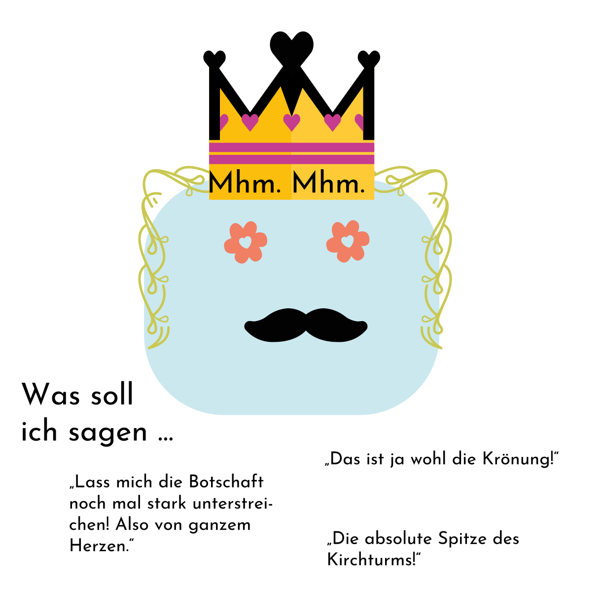

Laut [Wikipedia](https://de.wikipedia.org/wiki/Tag_der_Deutschen_Einheit) trat Thüringen mit Berlin, Brandenburg, Mecklenburg-Vorpommern, Sachsen und Sachsen-Anhalt um Mitternacht vom 2. auf den 3. Oktober 1990 der Bundesrepublik Deutschland bei. Damit war die Wiedervereinigung Deutschlands vollzogen. Die DDR hörte auf zu existieren. Die Wiedervereinigung wurde am 3. Oktober 1990 in Berlin gefeiert. Der 3. Oktober ist seitdem der Tag der Deutschen Einheit.

Ein bedeutendes Datum. 

<!-- Das folgende hat Copilot vorgeschlagen. Schrecklich gut, diese KI… -->
Aber nicht nur für Deutschland. Auch für mich. 
<!-- jetzt komme wieder ich… -->
Im ganz kleinen. Klitzeklitzekleinen.

Also: schön, dass der "Eiserne Vorhang" gefallen ist. 
<!-- Und dass ich dich in Person kennenlernen durfte. Auch an einem 3. Oktober. -->
<!-- Ich habe mich darüber sehr gefreut. Aus verschiedenen Gründen. Egal, wie das damals gewirkt hat. Trinkspiel hin oder her. Ironie der Geschichte. Wahrscheinlich schlicht und einfach Zufall, in den zu viel reininterpretiert wird. Aber Zufall kann auch Glück sein, ist es häufig auch. -->

Seit 33 Jahren ist damit die Bundesrepublik Deutschland Grundlage unseres Wohlstands – und natürlich auch all der Ungerechtigkeit und Bildungsungerechtigkeit in diesem Land. Und der Bundestag (bekanntlich…) Teil unserer Hoffnung für eine bessere Zukunft, genauso wie viele andere Menschen und ihre Gedanken und ihr zivilgesellschaftliches Engagement als Bürger:innen dieses Landes.

<!-- Und damit gilt auch: seit DREI Jahren kenne ich dich. -->
<!-- Seit fast einem Jahr muss ich mir selbst eingestehen, dass… Nun ja… Alles schon geschrieben… -->

All das war ein langer Weg, beschwerlich, nicht leicht, schwierig, kompliziert. Für mich heute kaum nachzuvollziehen. Aber friedlich und unterm Strich doch, so finde ich, gut und richtig. Ich hätte es mir nicht anders vorstellen können und weiß, dass es nicht selbstverständlich ist. Was hat es gebraucht? Ich glaube, ein paar Menschen, die über ihren Schatten springen, und die dazu noch ein paar richtige Entscheidungen getroffen haben. Und aufeinander zugegangen sind, mit Respekt. Und natürlich braucht es etwas (oder ganz viel) Glück. 🍀 

<!-- Dein Gero -->
<!-- ❤️ -->

<!-- (sorry für die Kommentare liebe Leser:innen, aber der Spagat zwischen "unangenehm" und offener Kommunikation ist klein :)) -->